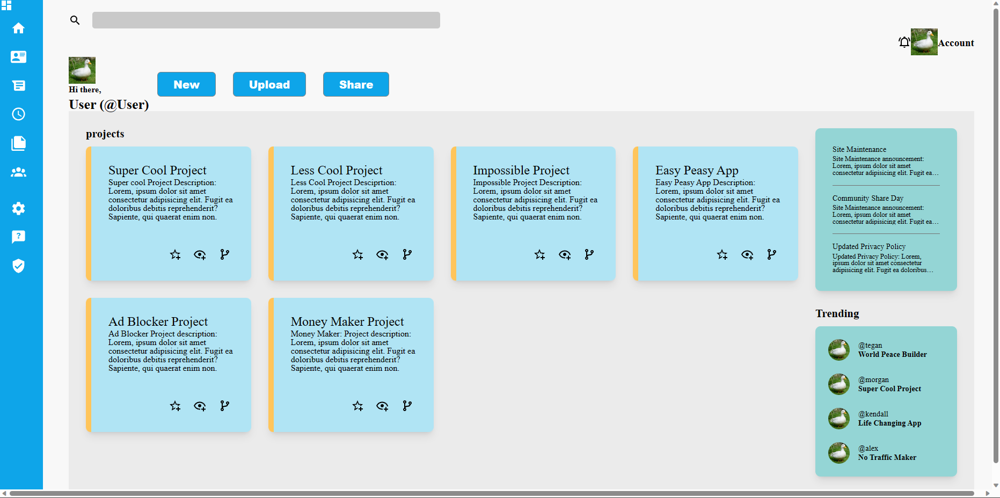

# Dashboard Project

This project is a dashboard to display various information such as projects in the form of cards apart of a main section of the website. There is a quickly accessible side menu and top bar for quick navigation, along with information cards for annoucements and trending users

The intention for this project is to demostrate a basic understanding of HTML and CSS, this project will lay the foundations for future projects.

## goals

1. Quick navigation side bar with animations
2. Main body sectioned off as cards for each project
3. demostrate understanding of HTML and CSS
3. Mimic the design provided from the project prompt

## credit
Thanks go the odin project for the project prompt and guidelines (https://www.theodinproject.com/lessons/node-path-intermediate-html-and-css-admin-dashboard)

also thanks go to codingWithRobz for help with the project (https://github.com/codingWithRobz/)